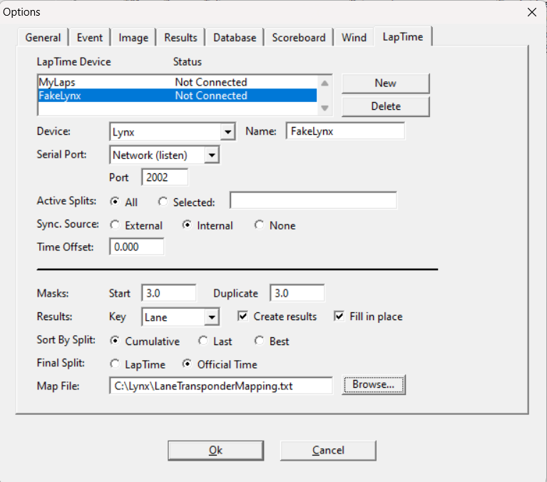

# FakeLynx

A .NET console application that uses the Lynx Laptime Protocol to simulate races where a Lap Time
device sends timing events to FinishLynx.

Select the 'Lynx' device type when configuring a FinishLynx LapTime device. Port 2002 is the standard
port for these devices, but any port can be configured in the race config file.

Between 1 and 10 racers can be configured for a race and a race may contain any whole or half number
of laps (1, 4, 4.5, 9, 13.5, etc.). Each racer can be provided with an average split time or a fixed 
list of split times. If using the average split time, a variance will be calculated for each lap so
that the results will vary between runs. 

For races with a whole number of laps, the first lap will have a extra duration multiplier applied
to account for the acceleration delay off of the start. For races with a half number of laps, a
fraction of the average split time will be used to account for the shorter distance covered.

For races with a whole number of laps, the racers will start at the finish line. As such, right at
the start, the transponders will detect a passing. The FinishLynx mask settings should be 
configured to account for this. If 'dual_transponder' mode is enabled, whenever a lap crossing is
synthesized, two crossings will be sent, a configurable amount of time apart, to account for a
racer wearing a transponder on each ankle.


## FinishLynx Configuration



- To configure FinishLynx to receive data from FakeLynx, you must create a new LapTime Device (LapTime->Options->New)
- Use the Device: "Lynx" and name it "FakeLynx"
- In the "Serial Port" dropdown, select "Network (listen)" and set "Port" to 2002.
- Ensure Sync. Source is set to 'Internal'.
- The messages that FakeLynx sends to FinishLynx contain an id number. If using a real transponder device, this would be the transponder id. It is necessary to ensure your Map File contains the id->lane mappings FakeLynx uses. FakeLynx supports 1-10 racers, so if you add the following to your mapping file FinishLynx should link the race ids to the lane numbers correctly. Depending on your normal mapping file for real competitions, these values may or may not conflict. If they do not, you can simply add them to your regular config. If they do, you should create a backup of your original mapping file, update it to use the FakeLynx values while testing, and then restore the original versio for real usage.

``` LaneTransponderMapping.txt
# Used for FakeLynx Testing
1,1
2,2
3,3
4,4
5,5
6,6
7,7
8,8
9,9
10,10
```

## Configuration

The application uses YAML configuration files. See `config/sample-race.yml` for an example:

```yaml
race:
  laps: 9  # Could be any whole or half number (4, 4.5, 9, 13.5, etc.)
  tcp:
    host: localhost
    port: 2002

  dual_transponder:
    enabled: true # to generate two transponder events on each crossing or not
    delay_milliseconds: 50.0 # how long between transmissions on each transponder

skaters:
  - lane: 1
    average_split_time: 12.2  # seconds
  - lane: 2
    average_split_time: 11.8

# If using specific lap times
#
#  - lane: 1
#    times:
#      - 7.633
#      - 10.267
#      - 9.933
#      - 9.967
#      - 10.367
#  - lane: 2
#    times:
#      - 7.433
#      - 10.000
#      - 9.667
#      - 9.733
#      - 10.167
```

## Protocol Implementation

The application implements the FinishLynx LapTime Protocol exactly as specified:

- **S Opcode**: Split time packets with lane number
- **Z Opcode**: Zero/start time packets
- **T Opcode**: Time sync packets
- **Sync Status**: Uses 0x01 (sync ok) for real-time packets
- **Format**: `<sot><opcode>,<time>[,<identifier>[,<event>,<round>,<heat>]]<eot>`

### Example Packets
```
01S,13:24:12.876,2\r\n
01Z,13:23:15.345\r\n
01T,13:24:00.000\r\n
```

## Race Logic

### Lap Time Calculation
- **Half-lap races**: First lap is 0.75x average time
- **Integer lap races**: First lap is 1.25x average time
- **Variability**: ±8% random variation plus performance trends
- **Realism**: Occasional "bad laps" or "great laps" for variety

### Performance Trends
Each skater has a consistent performance trend (95-105% of average) to create realistic race outcomes where different skaters can win on different runs.

